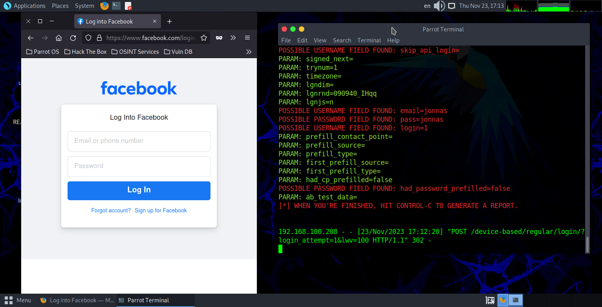

## Desafio DIO phishing
Nesse desafio, criamos uma pagina de login
fake usando a ferramenta (*setoolkit*) no 
kali linux.

## Passo a passo
primeiro, abra o terminal em modo root (sudo su)
e depois inicie a ferramenta com o comando **setoolkit**, apos isso ira abrir algumas opções da ferramenta onde você ira escolher o numero da opção desejada e depois pressione a tecla *enter*. Para o proposito da aula, segue o passo a passo:

- passo 1: 1) social-enginnering attacks.

- passo 2: 2) website attack vectors.

- passo 3: 3) credential harvester attack method.

- passo 4: 2) site cloner

- passo 5: o ip da maquina estara entre colchetes, exemplo: [192.168.100.100] apos verrificar se esta tudo correto, clique em *enter*.

- passo 6: agora usando *http*, escolha um site como facebook ou instagram para fazer o login, exemplo: http://www.facebook.com

## Resultado

apos feito todo o passo a passo, use o ip da maquina no navegador para poder fazer o teste como mostrado abaixo 👇.

 

 

Assim, o usuario ira por seu login e senha, sendo levado para a tela real do facebook, mas com seus dados salvos no terminal do atacante, exemplo logo abaixo 👇.

 

